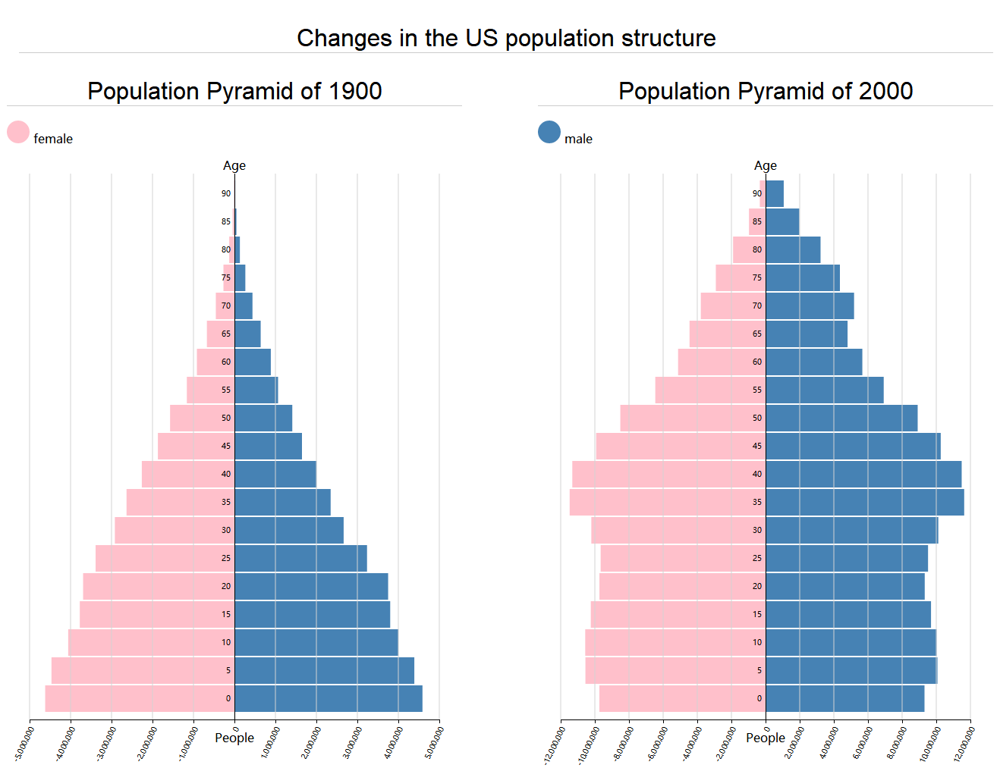

# Visual design of US population data

####&emsp;&emsp; &emsp;&emsp;&emsp;&emsp;&emsp;&emsp;&emsp;&emsp;&emsp;&emsp;Name：Wang Guangyu &emsp;&emsp;Student ID：201620130145

## 1. Description of the data：

Every 10 years, the census bureau documents the demographic makeup of the United States, influencing everything from congressional districting to social services. This dataset contains a high-level summary of census data for two years a century apart: 1900 and 2000. The data is a CSV (comma-separated values) file that describes the U.S. population in terms of year, reported sex (1: male, 2: female), age group (binned into 5 year segments from 0-4 years old up to 90+ years old), and the total count of people per group. There are 38 data points per year, for a total of 76 data points. 

## 2.Submit questions：

We observed that there are four attributes by observing the given csv file. For each observation angle, each attribute occupies a different position. Since the data gives the data for 1900 and 2000, obviously, we can think of observation. From 1900 to 2000, the population results changed. Ageing is a serious problem in today's society. Visualizing the data and seeing how the structure of the US population has changed is also what most of us care about. We can see which age group has the largest number of people, and we should also pay attention to the quantitative differences between men and women, which will be drawn from the later design analysis.

## 3.Data processing：

For visual design, we have a lot of tools, we can use a variety of existing tools, but this is our first experiment, I think it is very important to understand by using the existing API. So I use d3 to process the data and use svg to image, because my concern is that the US population structure is different in 1900 and 2000, so the data is naturally divided into two categories. For the convenience of later programming, the data in different years are divided into two parts, census1900.csv and census2000.csv. Of course, for large data classification, you can also use python to achieve. Explain that classifying data into two csv files is for the convenience of my programming. , does not have a big impact on the reading of data.

## 4.Visual design：

Since it is necessary to observe changes in the demographic structure, we naturally think of the population pyramid. Through the structure of the population pyramid, we can observe the age difference and gender difference to the maximum extent and intuitively. The advantages over histograms or scatter plots are undoubtedly huge.

**①**For a visual design, the title is necessary, it illustrates the problem we are going to study. In this visual design, I am using
**Changes in the US polulation structure**

**②** Since it is a comparison of demographic structure, I will divide the whole screen into two parts, the population pyramid model of 1900 and 2000. Of course, each pyramid will have a corresponding title.

**③**I chose to use the population as the abscissa and the age as the ordinate.

**④**After the coordinates are selected, we will use d3 to read the data from csv so that our maximum abscissa and ordinate are already limited.

**⑤**For each pyramid I chose to use the left side to display the female data, and the right side to show the male data.

**⑥**Men use blue and women use pink, which is also in line with public perception.

**⑦**The horizontal axis is divided into 10 parts by me, which means that the total number of men and women in each age group is divided into 5 blocks. In my opinion, this is a suitable number, because the selection is too dense, and Too little selection is not conducive to estimating specific data.

**⑧**The visualization model has been initially established

## 5.Design improvement

Below I will talk about a slight improvement in design from the problem to be studied.

**①**For the choice of color, the choice of color is also very important to me, although I will give a different description of the selected color, but if you use color to map the gender, people will have a fixed understanding, for example, Orange to represent women, black to represent men, this situation is natural, but not a very suitable solution. If pink is used to represent women, and steel blue is used to represent men, it will add a lot of visual design. This can be seen by referring to the icons in public places. It can be seen that pink is always used to represent women and blue is used to represent men. I didn't choose blue in the color selection, but a softer steel blue, because blue is more dark blue. We have already explained that women choose pink, dark blue and pink will be very big in color difference. We are not focusing on the difference between the number of men and women, which will invisibly divert people's attention, and if the dark color is used to indicate the amount of data, it will always give the illusion. If almost the same number, people will use dark blue. The number of males is more misunderstanding. Considering various situations, the color is finally selected, and the effect is also met.

**②**The horizontal axis represents the total number of people in the age group. The 2000 population pyramid showed overlap when displaying numbers because my screen size was limited, although I could improve it by reducing the width of the 1900 population pyramid and increasing the population pyramid width of 2000. But obviously this is very unsightly in terms of visual perception, so I finally thought of the way to rotate the numbers. For consistency, the display of all horizontal axis numbers is done 60 degrees around the x axis, so It solved the problem perfectly.

**③**One of the disadvantages of this design is that the data is relatively large for the y-axis. If we want to observe the data, it is very inconvenient, so I redefine a grid drawing function. The color set in css is bright gray. This will not affect the original color, and it will help us to estimate the data. In js it is like this.

```javascript
//定义格栅绘制函数
function make_x_axis(){
    return d3.svg.axis()
        .scale(x)
        .orient("bottom")
        .ticks(10);
}
```
Just use it when using the svg canvas.

**④**When I display the pyramid, since I don't define the spacing on the y-axis, the effect is very unattractive. The whole looks like a complicated jagged convex polygon, so as long as a small processing is performed, an imaginary scale is defined for the y-axis. At the time, the layer difference is set. After several different attempts, I used a value of 0.05, the code looks like this:

```
//为y轴定义新的虚数比例尺，值域为从height到0，每一层的差值为0.05
var y = d3.scale.ordinal()
    .rangeRoundBands([height,0], 0.05);
```

## 6.Effect & Description


Through the observation of the image we can see that the 1900 American Population Pyramid is:
 **Expansion**：The proportion of young people is relatively large, gradually decreasing from the lowest age group to the highest age group. The shape of the tower is wide below but narrower above.

 And the 2000 US Population Pyramid is:
 **Stable**：Except for the oldest age group, the other age groups are roughly the same, and the enlargement or reduction is not obvious, and the tower shape is relatively straight.

In addition, we can see that in 1900, the gender difference in all age groups in the United States was not large, but in 2000, the number of males in the age group after 35 years old was more than the number of females.

### Social problems：
In 1900, the birth rate of the United States was much larger than the mortality rate. The age of 30 and below was the main force of the population. However, in 2000, the middle-aged people became the main force, and the population of the elderly was much larger than that of the elderly in 1900. This reflects to a certain extent the rapid progress of society, the improvement of people's living standards and medical standards, but we should pay more attention to its development trend. The most serious one is that the structure of the population pyramid will become very wide. The type of aging is now a concern of the society. This change will have a very large impact on all aspects of the United States. Ageing will change the politics, economy, and culture of the United States. Of course, this issue will also affect everyone's wealth and investment strategy. Another problem is that the male population of middle age and above is larger than the female population, and this change has a tendency to increase, which is often referred to as the “single bachelor problem”. This is also a big hidden danger. To solve these problems, the efforts of the government and the community are needed.