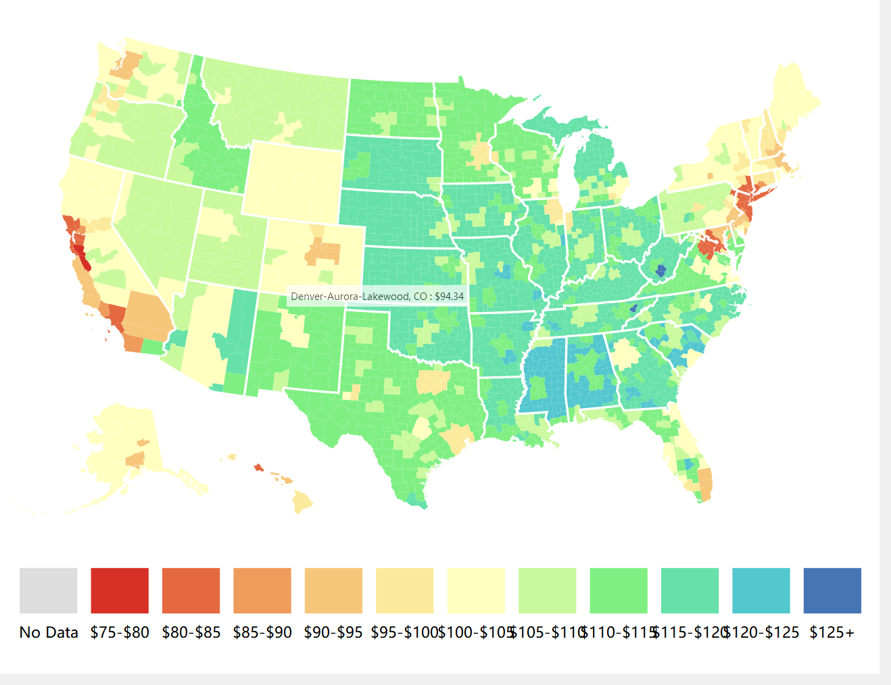

# Visual design of US country tax data

#### &emsp;&emsp; &emsp;&emsp;&emsp;&emsp;&emsp;&emsp;&emsp;&emsp;&emsp;&emsp;Name：Wang Guangyu &emsp;&emsp;Student ID：201620130145

## 1. Description of the data：

The data comes from the US Taxation Foundation. The data in csv has four attributes: country, state, value, name, 50 states in the United States, one direct jurisdiction (the capital of the District of Columbia), and five island free states. Therefore, the corresponding serial number of the state attribute is from 1 to 56. Each state has its own county or district below, and they all have their own area code, where the value is the tax after each county processing (via other csv The final data obtained after the data is statistically weighted) is the name of each state under the name attribute.

## 2.Submit questions：

We observed that there are four attributes by observing the given csv file. For each observation angle, each attribute occupies a different position. Since the data gives tax data for each district and county in 2018, obviously, we want to observe Taxation differences in various states in the United States in 2018. Taxation is a good indicator of the economic disparity between states and a factor that reflects the size of each state's welfare, and this is what most of us care about.

## 3.Data processing：

We used the csv data processed by d3 when the US Tax Foundation has processed the data. Because there are many types of taxation and are linked to various factors, the Foundation has already dealt with it.

## 4.Visual design：

Since we are observing the taxation of counties under the states of the United States, we naturally need to get a map of the United States. We also get json data, which will help us draw a map of the United States.

**①**The US map is drawn using the corresponding queue structure through the data given in json
**②**Since it is to observe the taxation of each state, when the mouse stays in a certain state, it should be said that the state’s name and tax amount are displayed in real time.
**③**For different states, different colors should be used for differentiation. The distinction here should be based on the size of the tax. In addition, we should make corresponding labels because there are more colors to distinguish, and for better distinction, I use the color of the rainbow to mark it.

## 5.Design improvement

In the beginning, the data is divided according to the value attribute in csv. The value is from 0 to the maximum value, but this is not a good design. Finally, the minimum value of the data is found around 75.So we should choose the interval from the minimum to the maximum and divide it

## 6.Effect & Description

The final visualization shown above, the data is based on vlaue in csv, divided into 5, and the colors of different states are marked, hovering over a state or a state's capital or big city On the top, the tax size here will be displayed in real time.

Because I don't have more data, but this is not much different from my expectations. The northeastern coastal areas and the western coastal areas have the smallest tax revenues, and the central region has the largest amount. As we all know, the northeastern coast of the United States is a large business district centered on New York, while the west is home to Los Angeles and Silicon Valley. These two places are developed areas of the United States, and the welfare benefits are naturally the best in the United States. 

## 7.Summary

The design process of this visualization took about two weeks, and the actual total time spent on the experiment was about 10 hours (excluding the time of selecting the topic). Because this task was free to play, so I chose the topic at the beginning. It took a lot of time to change the topic in the middle, because I wanted to do visual design about China map at first, but I didn't find the right json data, so I chose to do the visual design of the relevant data in the US because Some time ago, China had a change in the tax threshold, so I wanted to look at the relevant taxes in the United States. I found the right data at the US Taxation Foundation, but I have limited capacity and I don’t know anything about taxation. I know that there are many categories, and there are many policies related to it, including retirement, education, and so on. But according to the data published on the website and our general understanding of the United States, we can know the location of the roughly developed regions of the United States, and the welfare policies in the developed regions are relatively more numerous, and the final results are combined with our imagination.