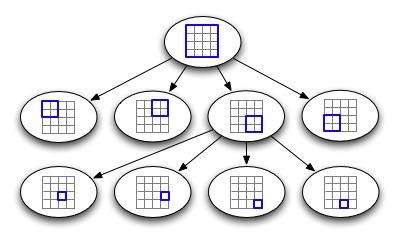

#### 1 Force-direct layout

- **思想**

  我们把节点想象成物理粒子，它们以随机的位置初始化，但在各种力的作用下逐渐位移，直到到达最终的位置。力由所选算法定义，通常寻求相邻节点之间的位置，但不要太靠近。

  具体地说，假设我们模拟两种力:所有节点对之间的斥力(repulsive force)，以及相邻节点对之间的弹簧力(spring force)。

  设$d$为两个节点之间的当前距离，定义它们之间的斥力为：

$$
Fr = \frac{Kr}{d^2}
$$

​	（由平方反比定律，如库仑定律所启发的定义），其中$Kr$是恒量(constant)。

​		如果节点相邻，则设节点之间的弹簧力为：
$$
Fs = Ks(d-L)
$$
​	（灵感来自胡克定律），$Ks$是弹性常量，$L$是弹簧的剩余长度(即忽略斥力，边沿“优选”的长度)。

- **实现**

  要实现这种力指向的布局，假设节点存储在数组节点中[]，其中数组的每个元素都包含一个位置x、y和作用于该节点的合力force_x、force_y。

  在一个循环中模拟这些力，该循环计算每个时间步长的合力，并更新节点的位置，希望直到布局收敛到一些良好的分布式位置。

- **伪代码**

```c
1 L = ... // spring rest length
2 K_r = ... // repulsive force constant
3 K_s = ... // spring constant
4 delta_t = ... // time step
5
6 N = nodes.length
7
8 // initialize net forces
9 for i = 0 to N-1:
10 	nodes[i].force_x= 0
11 	nodes[i].force_y= 0
12
13 // repulsion between all pairs
14 for i1 = 0 to N-2:
15 	 node1 = nodes[i1]
16   for i2 = i1+1 to N-1:
17   	node2 = nodes[i2]
18   	dx = node2.x - node1.x
19 		dy = node2.y - node1.y
20 		if dx != 0 or dy != 0:
21  		distanceSquared= dx *dx + dy*dy
22  		distance = sqrt(distanceSquared)
23  		force = K_r / distanceSquared
24 			fx = force * dx / distance
25  		fy = force * dy / distance
26  		node1.force_x = node1.force_x - fx
27  		node1.force_y = node1.force_y - fy
28  		node2.force_x = node2.force_x + fx
29  		node2.force_y = node2.force_y + fy
30
31 // spring force between adjacent pairs
32 for i1 = 0 to N-1:
33   node1 = nodes[i1]
34   for j = 0 to node1.neighbors.length-1:
35 		i2 = node1.neighbors[j]
36 		node2 = nodes[i2]
37  	if i1 < i2:
38  		dx = node2.x - node1.x
39 			dy = node2.y - node1.y
40  		if dx != 0 or dy != 0:
41  			distance = sqrt( dx*dx + dy*dy )
42 				force = K_s*( distance - L )
43  			fx = force*dx / distance
44 				fy = force*dy / distance
45  			node1.force_x = node1.force_x + fx
46  			node1.force_y = node1.force_y + fy
47  			node2.force_x = node2.force_x - fx
48  			node2.force_y = node2.force_y - fy
49
50 // update positions
51 for i = 0 to N-1
52   node = nodes[i]
53   dx = delta_t*node.force_x
54   dy = delta_t*node.force_y
55   displacementSquared= dx*dx + dy*dy
56   if displacementSquared > MAX_DISPLACEMENT_SQUARED:
57  	s = sqrt(MAX_DISPLACEMENT_SQUARED / displacementSquared)
58  	dx = dx *s
59  	dy = dy*s
60   node.x= node.x + dx
61   node.y = node.y + dy
```


- **特点**

  - **优点**

  （1）节点被建模为通过弹簧(边)连接的物理实体。灵活性高。

  （2）强大的理论基础(库伦定律、胡克定律)。

  （3）高质量的结果。至少对于中等尺寸(最多50-500个顶点)的图，得到的结果通常是非常好的:边长一致，顶点分布均匀，具有对称性。

  - **缺点**

  （1）容易陷入局部最小值。

  （2）高的运行时间。一般认为，典型的力向算法的运行时间等于$O(n^3)$，其中$n$是输入图的节点数。

- **局限性和提升**

  （1）难以选择合适的delta_t:如果时间步长为delta_t(用于第53、54行)太小，需要多次迭代才能收敛。另一方面，如果时间步长过大，或者产生的合力过大，节点的位置可能会发生振荡，永不收敛。56行对这种移动施加了限制。

  （2）作为一个次要的优化，第56行比较平方(即 displacementSquared > MAX_DISPLACEMENT_SQUARED而不是 displacement >MAX_DISPLACEMENT，以避免计算平方根的成本(除非if成功)。

  （3）GEM[16]算法通过在布局过程中降低一个“温度”参数来加快收敛速度，允许节点在这个过程中更早地移动更大的距离，然后逐步限制它们向末端移动。

  （4）小改进上面的伪代码是检测两个节点之间的距离是零(通过添加else子句if语句行20),在这种情况下,两个节点之间产生一个作用力在一些随机的方向,将它们分开。没有这个，如果两个节点碰巧有相同的邻居，它们可能永远“粘”在一起。

  （5）有无穷多对(Kr, Ks)值导致布局收敛到相同的最终“形状”(即边与边之间的角度相同，只是边的长度不同)。一个更简单的用户界面将允许用户更改一个参数，该参数对应于两种力的强度之比。布局的最终形状将取决于Kr/Ks和L。

  （6）在上面的伪代码中，排斥力的计算是一个瓶颈，因为它需要$O(N^2)$时间，其中N是节点数。

  （7）我们可以消除斥力，模拟相邻节点间长度为L的弹簧，以及相邻节点间长度为$2L$的弹簧，以及相邻节点间长度为$3L$的弹簧等，直到一定的极限。额外的弹簧将有助于分散网络，就像最初的斥力一样。只要边的数目不太多，弹簧也不太多，计算时间就可能大大小于$O(N^2)$。

  #### **2  QuadTree**

- **介绍**
  四叉树（quad-tree）是一种数据结构，是一种**每个节点最多有四个子树**的数据结构。

  

  四叉树的定义是：它的每个节点下至多可以有四个子节点，通常把一部分二维空间细分为四个象限或区域并把  该区域里的相关信息存入到四叉树节点中。我们将**完全处于某一个象限**的物体存储在该象限对应的子节点下，当然，也存在跨越多个象限的物体，我们将它们存在父节点中：

  如果某个象限内的物体的数量过多，它会同样会分裂成四个子象限，以此类推。

  我们有了四叉树的结构，对于力导向图中的求斥力操作，我们一开始做的是任意两个点之间都要做一遍操作，所以在这里我们这里可以提高效率。

  计算斥力的时候只用去算不是这个点的象限内的别的象限，把他们的重心（象限内所有点的坐标平均值）用作参数，然后每个点更新的时候就用象限计算的结果就行，少了的计算量就是不用每两个都求一次。

  这样用四叉树完成一次坐标更新后，我们需要重新判断点所在的象限，重复迭代操作，依次类推。